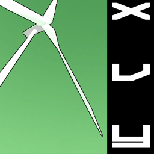

 #  LouveSystems' XvY 
XvY is a split-screen aerial-shooting game targeting the Xbox360, made for two players.

It is made to run on **Unity 5.4.X** and **only** on that version, at least for now - for this game targets the Xbox360 and the export plugin for that platform is, as of today, only publicly available for that unity version.
On the target hardware, it should run at 60 frames per second (somewhat) stable. Builds can also be made for Windows PC and Web, and have been shown to work without problem.

  
  
  

## Set up
If you want to build & run the game yourself, you will need:
- For PC : Any version of Unity compatible with **Unity 5.4.1** projects
- For Xbox360 : **Unity 5.4.1f1** with **Xbox360 support** (and of course, a proper license)
- For PS3 : **Unity 5.4.0b1** with **PS3 support** : however, PlayStation3 are so far extremely unstable, and my set up does not allow me to debug them efficiently. If you have an idea of what's wrong, feel free to issue & PR, I'd love to look into it.

## Inception
I just wanted to make a neat little game with a moving splitscreen, and had a pretty clear vision of what it should look like at the end so I went straight for it.
Then I had just obtained a second-hand Xbox360, so I thought why not turn it into a Devkit, and make the game target that platform. Pretty happy with the result :)

## Known issues
XvY is built to be as stable as possible and should never crash or error out.
- Some annoying bugs remain (like text alignment) that might be specific to the Xbox360 platform plugin.
- Sound can get slightly out of sync but will always synchronize back

LouveSystems 2025

